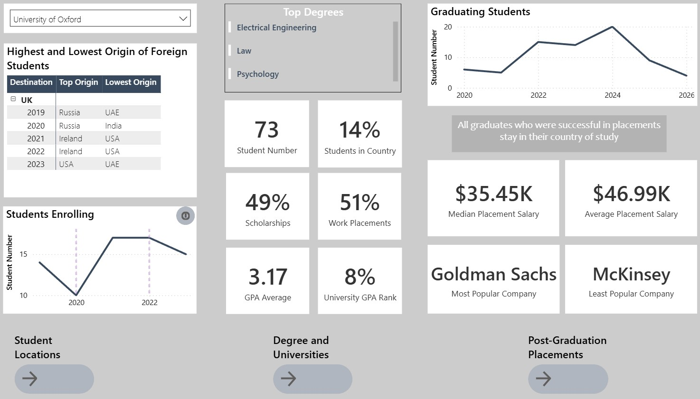
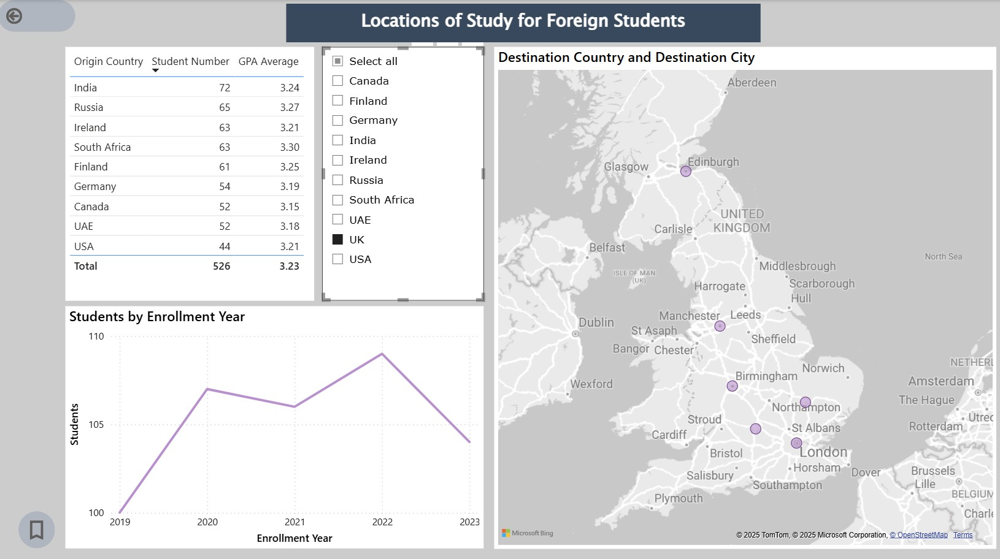
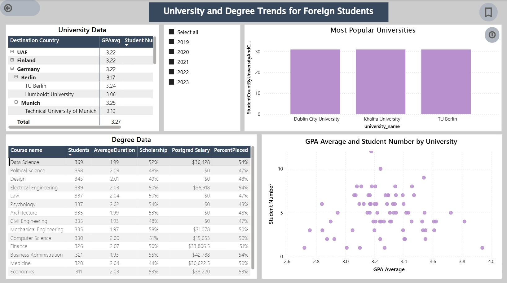
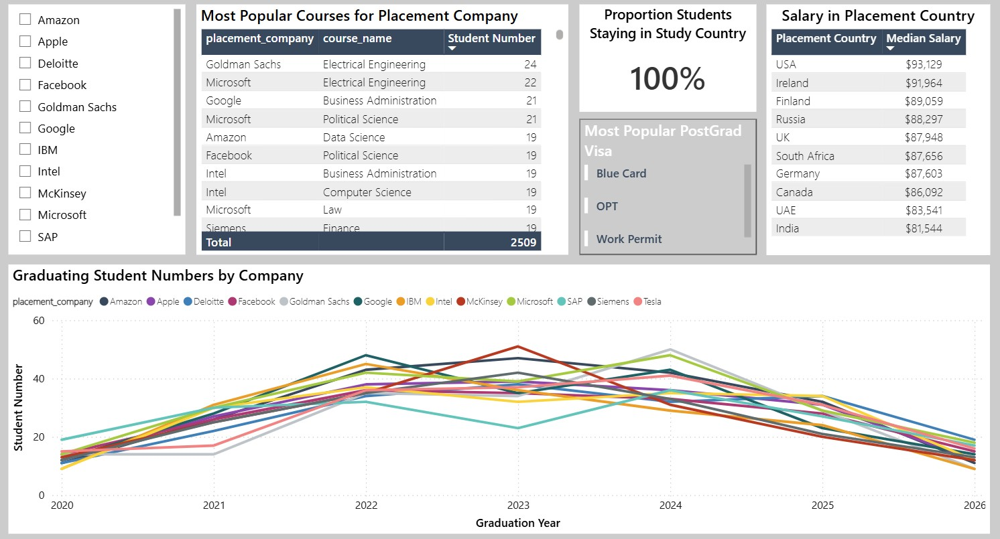

# University Admissions Dashboard

By John Haidoulis

## General Summary

Power BI Dashboard and reports on international student migration to select universities

## Scope

* For university admissions teams/executives for most universities. 
* I grouped the data into 3 clear categories (Locations, Degrees, Placements) to better gather detailed insights for specific metrics on the dashboard. 
* Note that the data is synthetic but realistic.
* The .pbix file can be downloaded and interacted with in MS Power BI desktop.

## Key Reports and Insights

### Dashboard

* Overview of all the data with the key metrics. 
* The effect of Covid is observed on student enrollment but some universities saw an increase in admissions whereas others saw a marked decrease.
* The origin countries of the most students compared to the least students is displayed first - This is highly useful information for the university to focus advertising on countries with the least number of visiting students compared to countries in which the university is already attracting a large cohort. This can be compared year on year.
* Relative competitiveness of university: Key metrics display the success of students during their degrees i.e placement success, gpa scores, and percentile rank relative to other universities.
* Key placement companies for successful graduate students. The University careers departments can focus investment in advertising and internship acquisition for the most and least popular company. It is interesting to quickly see and compare the top companies and the top degrees associated with the university.
* Bookmarks and navigation buttons are included to see more detailed reports.

### Locations

* Visual display of universities on the world map with cross filtering based on user selection of country or enrollment year.
* When selecting a country, the report provides insights on the top origin country of students over time of enrollment year. For example, if the USA is selected, the top number of students came from Ireland, but when filtering by the year 2020 (on the line graph), Germany was the top source country.

### Degrees

* Insights into how a particular university compared to others in terms of a specific degree with gpa and student number. Can identify key competition with other universities and where to focus advertising (based on locations report of a competing university) and relevant course programs.
* Can select a specific course and observe which are the top universities in terms of student success (gpa) and number.
* Can filter by year to compare popularity of certain courses over time.
* Lastly, the user can compare the effectiveness of each degree in terms of scholarship rates and postgrad placement salaries.

### Placements

* Additional details on prospective placement companies and prospective salary 
* Users can observe the percentage of students that studied and stayed in their country of study. It is important to see if the university getting students into the workforce of the respective country.
* Can compare the changes in popularity of each company over time based on student numbers. However it's not clear if this is due to student disinterest or fewer placement opportunities at these companies.

## Limitations

* Both the information about many other well-known universities and many countries are not included in the dataset. 
* The reports are not set up to deal with sensitive information (RLS) such as personal information. There is no sensitive information in the same dataset
* Only highly well-known companies are displayed with a lack of information on other non-tech industries.

### References:

* Data was extracted from the dataset called global_student_migration by Atharva Soundankar on Kaggle. 
* Dashboard theme from MS Themes Gallery by v-mfarrow (Matthew Farrow Example Theme)

